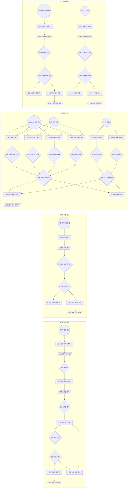

```mermaid
flowchart LR

  subgraph s1 ["관리자 차단 설정"]
    n1(("관리자 콘솔 진입"))
    n2["방송자 관리 목록 화면"]
    n3[/"방송자 목록 데이터"/]
    n4{"방송자 선택"}
    n5["방송자 상세 정보 화면"]
    n6[/"제휴 플랫폼 목록"/]
    n7{"차단 플랫폼 선택"}
    n8["차단 설정 확인 모달"]
    n9{"차단 설정 저장"}
    n10{"저장 처리 성공?"}
    n11["저장 완료 알림 화면"]
    n12["저장 실패 알림 화면"]
    n13[/"차단 설정 반영 상태"/]
  end

  subgraph s2 ["라이브 시청 차단"]
    n14(("시청자 라이브 진입"))
    n15["방송 정보 화면"]
    n16[/"방송자 기본 정보"/]
    n17{"라이브 방송 진입 시도"}
    n18{"해당 플랫폼 차단?"}
    n19["라이브 방송 시청 화면"]
    n20["시청 차단 메시지 화면"]
    n21[/"시청 불가 안내 메시지"/]
  end

  subgraph s3 ["후원/선물 차단"]
    n22(("웹·앱 후원 진입"))
    n26["후원/선물 진행 화면"]
    n27["선물 차단 메시지 화면"]
    n28[/"선물 불가 안내 메시지"/]
    n29(("Mobile App 후원 진입"))
    n30["랭킹 화면(App)"]
    n31{"랭킹 방송자 선물 시도"}
    n32{"선물 차단 적용(App)?"}
    n33["즐겨찾기 방송자 화면"]
    n34{"즐겨찾기 방송자 선물"}
    n35["아이템 구매 선물 화면"]
    n36{"아이템 구매 선물 시도"}
    n37["방송자 채널 화면(App)"]
    n38{"팝콘선물 버튼 클릭"}
    n39(("PP 후원 진입"))
    n42{"선물 차단 적용(PP)?"}
    n43["PP 즐겨찾기 화면"]
    n44{"PP 즐겨찾기 선물"}
    n45["PP 방송자 채널 화면"]
    n46{"PP 팝콘선물 클릭"}
  end

  subgraph s4 ["VOD 구매 차단"]
    n47(("Mobile App VOD 진입"))
    n48["VOD 목록 화면(App)"]
    n49[/"미구매 VOD 목록(App)"/]
    n50{"미구매 VOD 선택"}
    n51{"VOD 구매 차단(App)?"}
    n52["팝콘 VOD 구매 화면"]
    n53["VOD 차단 안내 화면"]
    n54[/"VOD 구매 차단 메시지"/]
    n55(("PP VOD 진입"))
    n56["VOD 목록 화면(PP)"]
    n57[/"미구매 VOD 목록(PP)"/]
    n58{"PP 미구매 VOD 선택"}
    n59{"VOD 구매 차단(PP)?"}
    n60["PP VOD 구매 화면"]
    n61["PP VOD 차단 안내"]
    n62[/"PP VOD 차단 메시지"/]
  end

  n1 --> n2
  n2 --> n3
  n3 --> n4
  n4 --> n5
  n5 --> n6
  n6 --> n7
  n7 --> n8
  n8 --> n9
  n9 --> n10
  n10 --> n11
  n10 --> n12
  n11 --> n13
  n12 --> n8
  n14 --> n15
  n15 --> n16
  n16 --> n17
  n17 --> n18
  n18 --> n19
  n18 --> n20
  n20 --> n21
  n27 --> n28
  n29 --> n30
  n30 --> n31
  n31 --> n32
  n32 --> n26
  n32 --> n27
  n29 --> n33
  n33 --> n34
  n34 --> n32
  n29 --> n35
  n35 --> n36
  n36 --> n32
  n29 --> n37
  n37 --> n38
  n38 --> n32
  n42 --> n26
  n42 --> n27
  n39 --> n43
  n43 --> n44
  n44 --> n42
  n39 --> n45
  n45 --> n46
  n46 --> n42
  n47 --> n48
  n48 --> n49
  n49 --> n50
  n50 --> n51
  n51 --> n52
  n51 --> n53
  n53 --> n54
  n55 --> n56
  n56 --> n57
  n57 --> n58
  n58 --> n59
  n59 --> n60
  n59 --> n61
  n61 --> n62
  n22 --> n30
  n22 --> n33
  n22 --> n35
  n22 --> n37
```
